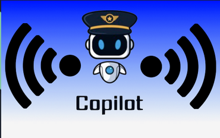

# Wireless Wingman
# 


<a href="https://github.com/Mindstormer314/AI-Camp-Data/tree/main/Copilot"></a> <a href="https://opensource.org/licenses/apache" rel="nofollow"></a>

<a href="https://drive.google.com/drive/folders/1-H_AeVwm7lJxVTs-c4kwzRtMvXlNGUTC"></a> <a href="https://opensource.org/licenses/apache" rel="nofollow"></a>

#### The Wireless Wingman is designed to take a simple prompt and to expand on that, so, for example, one can input “int sortArray(array)” and it will create code that follows that theme. [pre-trained GPT-2 variants](https://huggingface.co/transformers/pretrained_models.html) offered by the awesome [🤗 transformers](https://github.com/huggingface/transformers) library.


### Features
- Write with Python or Java.

### Files and Directories:

The architecture of files and directories are as follows:

* app/
	* model/
		* *EMITTED*
	*	static/
		*	css/
		*	img/
		* js/
		* favicon.ico	
	*	templates/
		*	C-Popup.html
        *	Cpp-Popup.html
        *	CS-Popup.html
        *	index.html
        *	Java-Popip.html
        *	JS-Popup.html
        *	Python-Popup.html
        *	writer_home.html
        *	write-your-code-with-AI.html
	*	main.py
    *	popup_main.py
	*	requirements.txt
	*	utils.py
* .gitignore
* Dockerfile
* Readme.md
* config.py
* entrypoint.sh
* host_config
* nginx_host


### Quick Start
Here provides three ways of quick-start. Before that,


#### Load from 🤗transformers models 
Now there are [two fine-tuned models](https://huggingface.co/models?search=congcongwang) uploded to 🤗transformers models library. They can be used easily as long as you `pip install transformers`


```python
from transformers import AutoTokenizer,AutoModelWithLMHead
tokenizer = AutoTokenizer.from_pretrained("congcongwang/gpt2_medium_fine_tuned_coder")
model = AutoModelWithLMHead.from_pretrained("congcongwang/gpt2_medium_fine_tuned_coder")
# or
# tokenizer = AutoTokenizer.from_pretrained("congcongwang/distilgpt2_fine_tuned_coder")
# model = AutoModelWithLMHead.from_pretrained("congcongwang/distilgpt2_fine_tuned_coder")
use_cuda=True
context="def factorial"
lang="python" # can be java as well.

if use_cuda:
    model.to("cuda")

input_ids = tokenizer.encode("<python> " + context,
                                     return_tensors='pt') if lang == "python" else tokenizer.encode(
            "<java> " + context, return_tensors='pt')
outputs = model.generate(input_ids=input_ids.to("cuda") if use_cuda else input_ids,
                         max_length=128,
                         temperature=0.7,
                         num_return_sequences=1)

decoded = tokenizer.decode(outputs[0], skip_special_tokens=True)
print(decoded)
```


#### Ready-to-go Interaction
```
git clone https://github.com/wangcongcong123/auto_coding.git
pip install -r requirements.txt
```

1. Download the fine-tuned models, here are two versions provided.
    * [distilgpt2_fine_tuned_coder (params: 82M, size: 291MB)](https://ucdcs-student.ucd.ie/~cwang/autocoder/distilgpt2_fine_tuned_coder.zip)
    * [gpt2_medium_fine_tuned_coder.zip (params: 345M, size: 1.22GB)](https://ucdcs-student.ucd.ie/~cwang/autocoder/gpt2_medium_fine_tuned_coder.zip)
2. Unzip the model and move it to `./model` (create it first)
3. Run the interact: `python interact.py`

#### Fine-tuning yours
```
git clone <this repository>
pip install -r requirements.txt
```

1. Preparing [the dataset](./dataset)
2. Start fine-tuning model: `python train.py --model_select distilgpt2` 
3. After fine-tuning, the model will be saved to `./model/distilgpt2_fine_tuned_coder/0_GPTSingleHead` which is exactly the fine-tuned version as provided in Ready-to-go Interaction.

\* For more params setting of training, `python train.py -h`

### Generative examples
Good Python generation examples by fine-tuned GPT2-medium
```python
-------------Example 1--------------------------------------
Context code: def factorial
Generated: 
def factorial(n):
    return 1 if n == 1 else n * factorial(n - 1)

--------------Example 2-------------------------------------
Context code: def sum_of_series(num_of_terms:int, power: int)
Generated:
def sum_of_series(num_of_terms:int, power: int) -> float:
    """Calculate Sum of Series.
    >>> sum_of_series(1, 1, 10)
    55.0
    >>> sum_of_series(1, 10, 100)
    49600.0
    """
    sum = (num_of_terms / 2) * power
    return sum

--------------Example 3-------------------------------------
Context code: def quick_sort(collection)
Generated:
def quick_sort(collection):
    """
    >>> quick_sort([0, 5, 3, 2, 2])
    [0, 2, 2, 3, 5]
    >>> quick_sort([])
    []
    >>> quick_sort([-2, -5, -45])
    [-45, -5, -2]
    """
    length = len(collection)
    if length <= 1:
        return collection
    else:
        # Use the last element as the first pivot
        pivot = collection.pop()
        # Put elements greater than pivot in greater list
        # Put elements lesser than pivot in lesser list
        greater, lesser = [], []
        for element in collection:
            if element > pivot:
                ...
```
Good Java generation examples by fine-tuned GPT2-medium

```javascript
--------------Example 1-------------------------------------
Context code: Scanner input= new Scanner(System.in)
Generated:
Scanner input= new Scanner(System.in)
System.out.println("Enter the Octal number: ");
// Take octal number as input from user in a string
String oct = input.next();

--------------Example 2-------------------------------------
Context code: private static int CountCharacters(String str)
Generated:
private static int CountCharacters(String str) {
        return str.replaceAll("\\s", "").length();
}
```
\* Although some generated examples look good, it needs to take a grain of salt to judge the model's actual performance. The model may simply **"remembers"** existing code in the training set well.


